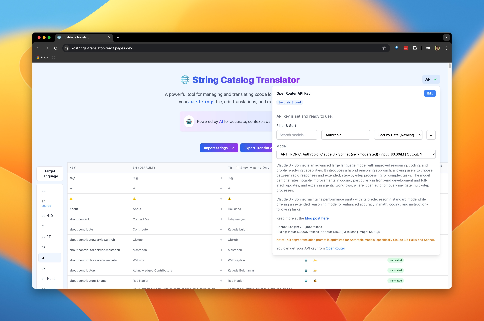

# Apple XCStrings Translation Tool

A browser-based React and TypeScript editor for reviewing Apple `Localizable.xcstrings` catalogs and requesting individual translations from OpenRouter. It is designed for a human-in-the-loop workflow: import a catalog, select an existing target language, review or edit simple and variation values, then export the updated JSON.

## Live demo

Try the deployed app at [xcstrings-translator-react.pages.dev](https://xcstrings-translator-react.pages.dev/).



## Verified capabilities

- Imports structurally supported XCStrings JSON with catalog version `1.0`.
- Displays the source language and every localization already present in the catalog.
- Edits simple `stringUnit` values and variation paths represented by the source catalog.
- Handles plural variations and recursively nested structures such as device → plural.
- Preserves substitution-backed localization trees while allowing safe edits to their required top-level `stringUnit`.
- Sends one selected string, its key, language pair, and optional entry comment to OpenRouter for an AI-assisted translation.
- Exports the updated catalog as `Localizable.xcstrings`.

The deterministic fixture suite covers positional and integer placeholders, entry and unit comments, extraction/translation metadata, multiple localizations, plural variations, nested device/plural variations, substitution-backed localizations, source-only entries, malformed JSON, unsupported versions, and unsupported structural shapes.

## Preservation contract and limits

Import/export is a semantic JSON round trip, not a byte-for-byte file round trip. Export uses two-space JSON indentation and a trailing newline, so the original whitespace and formatting are not preserved.

Untouched entries, localizations, comments, known metadata, and additional JSON fields are passed through. When a value is edited, the editor changes that unit's `value` and sets its state to `translated`; surrounding whitespace in a non-empty value and existing unit notes are retained. A whitespace-only edit is treated as deletion, except when substitutions require the top-level unit; that unsafe deletion is rejected and the localization remains unchanged. Switching a localization between a simple unit and variations intentionally removes the mutually exclusive representation.

Only terminal variation rows backed by a source `stringUnit` are editable. Intermediate variation containers are display-only, and the data layer independently rejects container, source-absent, and overlong variation paths so a malformed save cannot replace or delete a descendant tree.

Placeholder tokens such as `%@`, `%lld`, `%1$@`, and named substitution markers are not rewritten during import/export. Manual and AI-assisted edits fail closed when they remove, change, duplicate, or introduce a placeholder argument. Equivalent positional forms and reordered positional arguments remain valid, and locale-specific substitution units are checked against their existing named-marker contract. Placeholder meaning and surrounding grammar still require human review before export.

The importer performs targeted validation for the structures this editor uses; it is not a complete implementation of every current or future Apple XCStrings schema rule. It rejects malformed JSON, catalog versions other than `1.0`, malformed string/localization/variation shapes, and orphan substitutions without their required top-level `stringUnit` instead of attempting a lossy import.

The UI can select languages already represented somewhere in the imported catalog. It does not currently provide a control for creating a completely new target language.

## API key and data handling

This is a client-side application with no application backend in this repository. Imported catalogs are parsed in the browser. An AI translation request sends the selected source text, translation key, source/target languages, and optional entry comment directly from the browser to OpenRouter.

The OpenRouter API key is stored unencrypted in this origin's browser `localStorage` under `openrouter_api_key` so it persists across visits. A password-style input only masks the display; it does not encrypt the stored value. Scripts running on the same origin and browser extensions with suitable access may be able to read it. Use a scoped or low-limit key, remove it with the app's **Remove** control when finished, and avoid entering a production credential on a device or deployment you do not trust.

Report suspected vulnerabilities privately through the repository's [security policy](SECURITY.md), without attaching API keys or private catalog content.

## Local development

The supported toolchain is Node.js 22 with npm 10.9.4, recorded in `.nvmrc`, `engines`, and `packageManager` metadata.

```bash
git clone https://github.com/okturan/xcstrings-translator-react.git
cd xcstrings-translator-react
nvm use
npm ci
npm run dev
```

Open the local Vite URL, import a `.xcstrings` file, and add an OpenRouter key only if you want to exercise AI translation. Import, editing, round-trip tests, lint, and production builds do not require an API key.

## Quality checks

```bash
npm test
npm run test:e2e
npm run lint
npm run build
npm audit
```

The browser suite loads the production bundle in Chromium, imports the representative fixture through the real file input, proves that a placeholder-breaking edit is rejected without changing state, completes a valid edit through the table UI, validates the downloaded Blob-backed catalog, and verifies that malformed input remains fail-closed in the empty state.

GitHub Actions runs the locked install, behavior tests, lint, production build, and browser workflow on Node.js 22. It retains the Playwright report for seven days so a failed interaction has inspectable traces and screenshots. The workflow has read-only repository permissions, disables persisted checkout credentials, and pins official actions to immutable commit SHAs.

## Stack

- React 18 and TypeScript
- Vite 6
- Tailwind CSS
- Vitest behavior tests
- Playwright Chromium workflow tests
- OpenRouter API for model discovery and translation requests

## Contributing

Issues and pull requests are welcome. For parser or editor changes, add or update a deterministic fixture that demonstrates both the supported behavior and any intentional preservation boundary.
